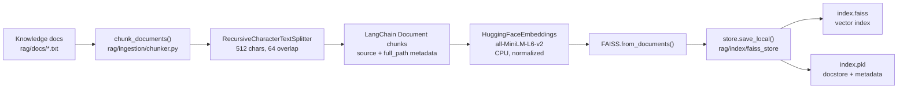
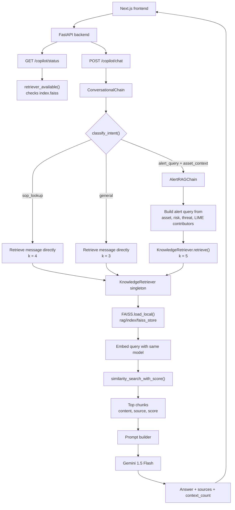

# FAISS Setup Visualization

This project uses a persisted LangChain FAISS vector store as the local knowledge
index for the AI copilot and alert explanation flows.

## Current Index State

```text
rag/docs/
  battery_oem_manual.txt
  cve_advisories.txt
  cyber_battery_fusion_guide.txt
  ids_incident_playbook.txt
  thermal_runaway_sop.txt

rag/index/faiss_store/
  index.faiss
  index.pkl
```

The index is built with `sentence-transformers/all-MiniLM-L6-v2` on CPU, using
normalized embeddings.

## Build-Time Flow



Build command:

```powershell
python rag/ingestion/build_index.py
```

## Query-Time Flow



## Main Components

| Area | File | Role |
| --- | --- | --- |
| Chunking | `rag/ingestion/chunker.py` | Reads `.txt` docs and creates overlapping LangChain `Document` chunks. |
| Index build | `rag/ingestion/build_index.py` | Embeds chunks and saves the FAISS store to disk. |
| Retrieval | `rag/retrieval/retriever.py` | Loads the persisted store and exposes singleton top-k similarity search. |
| Alert RAG | `rag/chains/alert_chain.py` | Builds an alert-specific query, retrieves top 5 chunks, and grounds Gemini output. |
| Copilot RAG | `rag/chains/conversational_chain.py` | Routes user intent and retrieves context for SOP/general/copilot requests. |
| API status | `backend/routers/copilot.py` | Reports whether `index.faiss` exists and whether `GEMINI_API_KEY` is set. |
| Frontend status | `frontend/src/lib/api.ts` | Types and calls the copilot status/chat endpoints. |

## Operational Notes

- Rebuild the index after changing files in `rag/docs/`.
- `KnowledgeRetriever` is cached as a singleton, so call `KnowledgeRetriever.reset()`
  if the app process needs to reload a freshly rebuilt index without restarting.
- `allow_dangerous_deserialization=True` is required by the current LangChain FAISS
  loader because `index.pkl` contains the persisted docstore metadata.
