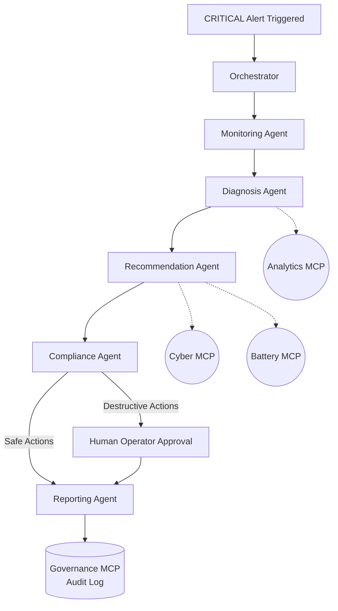

# 🤖 V3 — Autonomy Layer: Implementation Plan

## 5-Agent System & MCP Servers (Weeks 11–16)

> **Goal:** Transition the platform from an "advisory copilot" to a five-agent autonomous system backed by four Model Context Protocol (MCP) servers. Every action is logged, and destructive actions are securely gated by a Compliance Agent.

---

## Current State (V2 ✅ Complete)

| Component | Status |
|-----------|--------|
| V1: ML Pipeline + Dashboards | ✅ Built & Running |
| V2: RAG Knowledge + FAISS Vector Store | ✅ Built |
| V2: AI Copilot Chat Interface | ✅ Built |
| V3: Agent Core Definitions | 🟡 Partially Built (`recommendation_agent.py` exists) |
| V3: MCP Servers | ❌ Empty Directories |
| V3: Agent Orchestrator / Redis | ❌ Not Started |

---

## V3 Architecture



---

## Week-by-Week Build Plan

### Week 11 — Agent Framework Setup

#### Files to Create
```
agents/
├── base.py                 ← BaseAgent class & schema
├── orchestrator.py         ← FastAPI event-driven orchestrator
└── bus.py                  ← Redis pub/sub wrapper
```

#### Key Decisions
| Decision | Choice | Reason |
|---|---|---|
| Inter-agent Comms | Redis Pub/Sub | High throughput, lightweight, decouples agents |
| Agent State | Event Payloads | Stateless agents scale better; state passed via event payload |
| Error Handling | Dead Letter Queue | Failed agent states are saved for human review |

#### Deliverable
- [ ] `AgentInput` and `AgentOutput` Pydantic schemas defined in `base.py`.
- [ ] Redis pub/sub integration implemented (`bus.py`).
- [ ] `orchestrator.py` capable of triggering an agent sequence.

---

### Weeks 12 & 13 — Agent Implementation

#### Files to Create
```
agents/
├── monitoring_agent.py     ← Initial triage and risk evaluation
├── diagnosis_agent.py      ← Root cause analysis via RAG + LIME
├── compliance_agent.py     ← Gates actions (quarantine, shutdown)
└── reporting_agent.py      ← Finalizes log and persists to Governance MCP
```

#### Updates to Existing Files
- Refactor `recommendation_agent.py` to utilize proper Redis Event Bus inputs/outputs.

#### Deliverable
- [ ] 5 Agents built and tested individually.
- [ ] `ComplianceAgent` successfully flags destructive actions as "Requires Human Approval".

---

### Week 14 — MCP Servers Implementation

#### Files to Create
```
mcp_servers/
├── battery_mcp/server.py   ← get_asset_health(), flag_for_maintenance()
├── cyber_mcp/server.py     ← get_active_alerts(), quarantine_asset()
├── analytics_mcp/server.py ← run_prediction(), get_feature_importance()
└── governance_mcp/server.py← write_audit_log(), policy_check()
```

#### Tool Schema Constraints
- Each server exposes tools via the Model Context Protocol (MCP) using a standard FastAPI interface.
- **Governance MCP** will manage `audit_logs/*.jsonl` immutably.

#### Deliverable
- [ ] All 4 MCP servers running on ports 8001–8004.
- [ ] `governance_mcp` creates an immutable audit trail entry for every tool call.

---

### Weeks 15 & 16 — Orchestration, UI, & Polish

#### Files to Create (Frontend)
```
frontend/src/app/
└── audit/
    └── page.tsx            ← Audit Trail and Agent Timeline UI

frontend/src/components/
├── AgentTimeline.tsx       ← Visualizer for agent hops
└── ApprovalModal.tsx       ← Human-in-the-loop approval prompt
```

#### UI Features
| Feature | Description |
|---|---|
| Audit Trail | Real-time feed of all agent actions and MCP tool executions. |
| Agent Timeline | Visual progress bar showing alert transitioning through the 5 agents. |
| Human Approval | Modal triggering when Compliance Agent blocks an action like `quarantine_asset`. |

#### Deliverable
- [ ] CRITICAL risk event triggers full agent pipeline automatically.
- [ ] Audit Trail page displays complete timeline of events.
- [ ] Human approval flow successfully integrated and tested.

---

## Prerequisites Before Starting

- [ ] Ensure Redis is installed and running (`redis-server`).
- [ ] V2 must be fully stable (API & Next.js dashboard).
- [ ] Add `REDIS_URL` and MCP ports to `.env`.

---

## V3 Definition of Done ✅

- [ ] All 4 MCP servers actively listening on respective ports.
- [ ] 5-Agent pipeline executes seamlessly via Redis pub/sub.
- [ ] Destructive actions cannot proceed without Human-In-The-Loop (HITL) approval via Next.js UI.
- [ ] All agent decisions and MCP tool calls are permanently stored in `audit_logs/`.
- [ ] `/audit` UI page is live and displays logs correctly.
